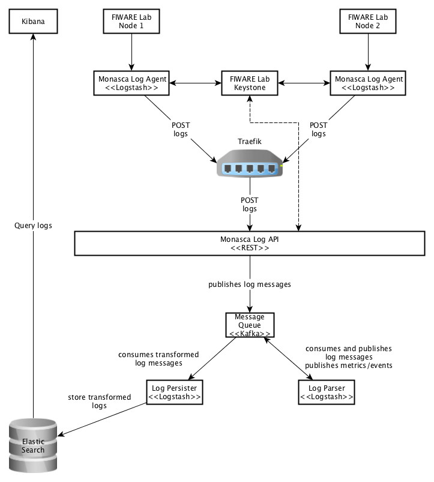

## Architecture of Deep Log Inspection
The architecture of the system can be depicted as follows:

The logs are sent using syslog from [FIWARE Lab][1] Nodes to the Monasca Log Agent, installed on a remote machine.

The Monasca Log Agent sends the logs to Traefik, a HTTP reverse proxy and load balancer. Traefik then forwards the logs to the Monasca Log API. Both the Agent and the API must be authenticated to the FIWARE Lab Keystone to function properly.

The Monasca Log API publishes the logs into the Kafka message queue. In Kafka, two topics for publishing logs are created: `monasca-log` and `logstash-log`. The first topic is for logs that are published by the Monasca Log API and received by the Log Parser. The second topic is for logs that are transformed and published by the Log Parser and received by the Log Persister.

The Log Persister defines the indexing for each log message and sends them to Elasticsearch for storage. After the logs are stored, they can be searched and visualized in Kibana, a front-end application for Elasticsearch.

## High Availability
All services in the system are scalable. By default, Elasticsearch and Kibana are scaled for High Availability. Here follows the HA deployment architecture for Elasticsearch:

Depending on whether the traffic comes from inside the system (e.g. Log Persister) or from outside (e.g. user HTTP requests), load balancing is either managed by Docker Swarm (DNSRR for Elasticsearch, default: VIP) or by Traefik (WRR).

[1]:https://www.fiware.org/lab/
