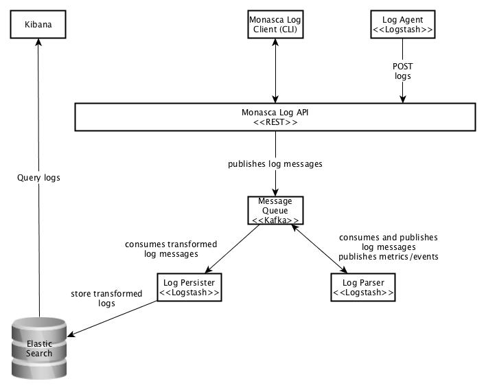

## Architecture
The architecture of the system can be depicted as follows:

The logs are sent to the system by the Monasca Log Agent, installed on a remote machine. The Log Agent collects logs from FIWARE Lab Nodes via syslog and sends them to the Monasca Log API. The logs are then published into the Kafka message queue.

In Kafka, two topics for the publishing of logs are defined: `monasca-log` and `logstash-log`. The first topic is for logs that are published by the Monasca Log API and received by the Log Parser. The second topic is for logs that are transformed and published by the Log Parser and received by the Log Persister.

Then, the Log Persister defines the indexing for each log message and sends them to Elasticsearch for storage. After the logs are stored, they can be searched and visualized in Kibana, a front-end application to Elasticsearch.
