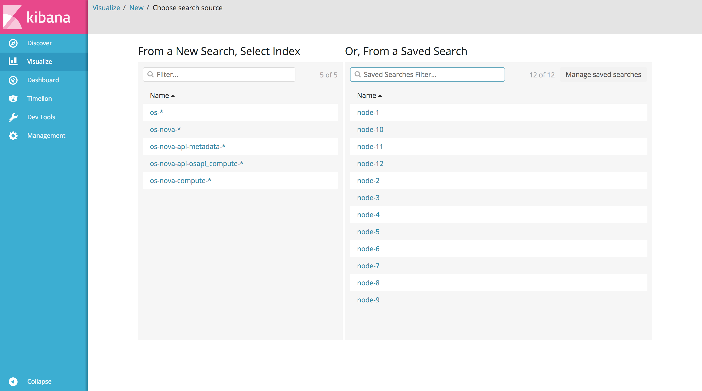
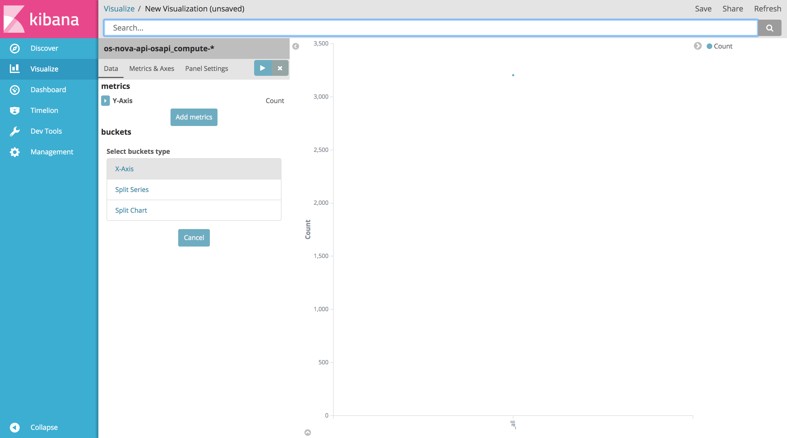
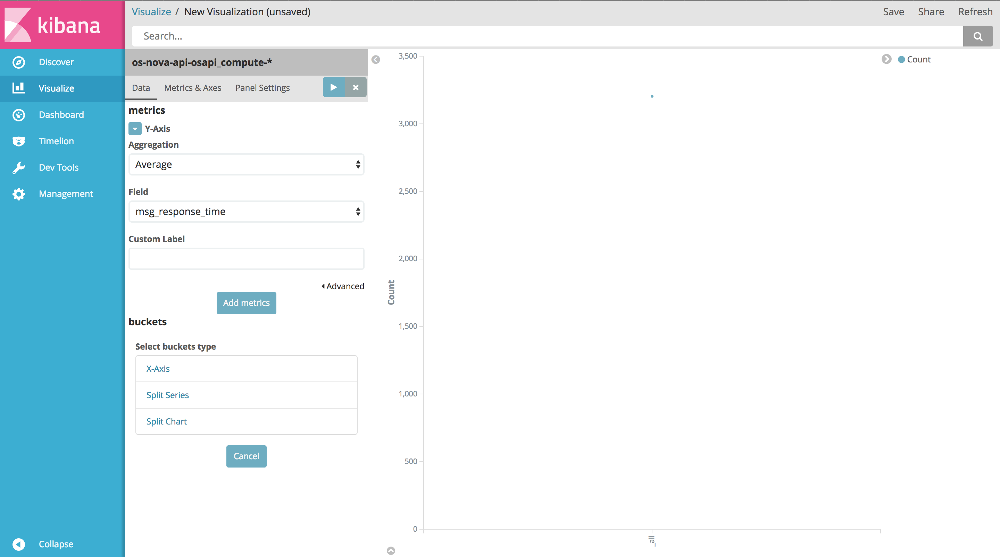
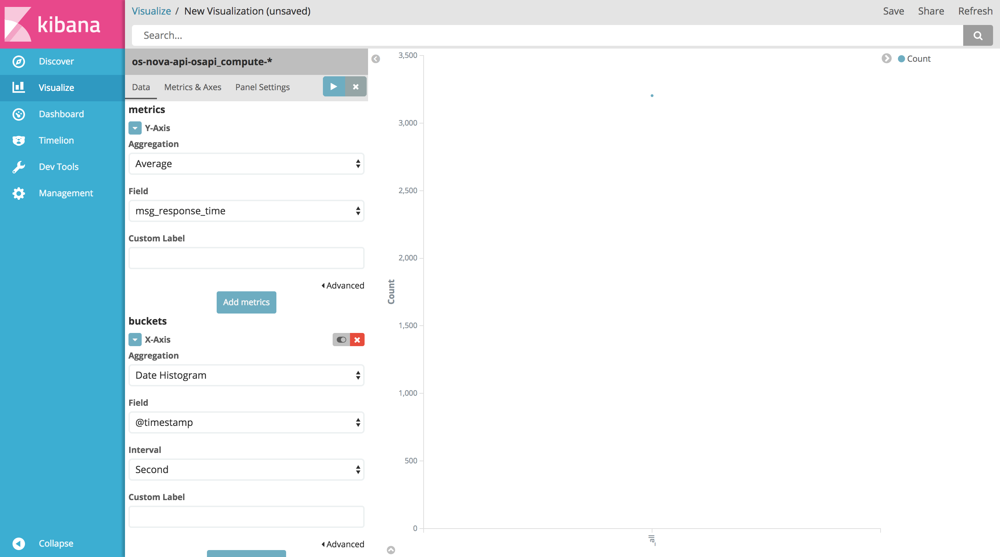
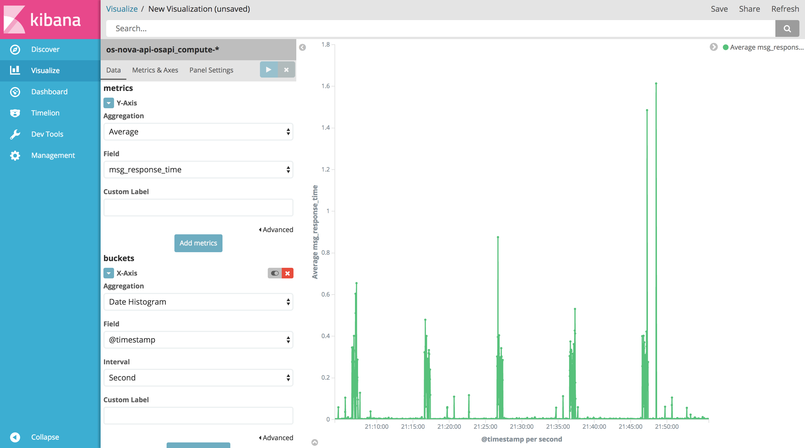

## Visualizing in Kibana
Kibana allows the user to [visualize][1] the data in the Elasticsearch indices with a variety of charts, tables and maps.

To [create a visualization][2], select `Visualize` from the left pane menu, then `+` or `Create a visualization`, and choose the visualization type that better serves your purpose (e.g. line chart).

In general, charts can be used to plot metric aggregations, e.g. count, average, sum, percentiles, etc., of a search, using some field's value, filters, ranges or whatever tool is more appropriate. For all details on charts and metrics, visit [this page][3].

Kibana provides a rather large variety of options to visualize the data. Since this guide could not be more exaustive than [Kibana User's Guide][4], here it is more appropriate to show the main concepts and features of visualization with an example.

#### Example: Nova API's average response time
Select `Visualize` from the left pane menu, then `+` or `Create a visualization`, and choose `Line` to create a line chart. This should lead to a page like the following:

Now select `os-nova-api-osapi_compute-*` as index pattern (if it does not exist, [create it][5] first, in the `Management` section).

In the `metrics` section, select the button that contains a small triangle to expand the `Y-Axis` configuration:

In the `Aggregation` selection menu, choose `Average`. Then select `msg_response_time` as field.

Now, in order to display timestamps on the x-axis, click `X-Axis` in the `buckets` section:

Select `Date Histogram` as aggregation, `@timestamp` as field, and `Second` as interval. Optionally, the axes can be labelled so as to visualize custom names for the axes in the chart.

Now that the required parameters are set, click the `Apply changes` button on the top right of the pane. The resulting chart will be rendered on the right:

Now that the visualization has been created, it can be saved. Click `save` on the top right of the page, give the visualization a name and click `Save` again.

Saving visualizations allows to reopen them later. Any changes in the dataset will be reflected automatically in the chart as it is reopened or rendered again using the `Apply changes` button.

#### Dashboards
Saved visualizations can also be grouped and viewed together in a [dashboard][6]. Elements in a dashboard can be resized and rearranged at will. Like visualizations, dashboards can be saved for later use.

[1]:https://www.elastic.co/guide/en/kibana/5.x/visualize.html
[2]:https://www.elastic.co/guide/en/kibana/5.x/createvis.html
[3]:https://www.elastic.co/guide/en/kibana/5.x/xy-chart.html
[4]:https://www.elastic.co/guide/en/kibana/5.x/index.html
[5]:https://www.elastic.co/guide/en/kibana/5.x/tutorial-define-index.html
[6]:https://www.elastic.co/guide/en/kibana/5.x/dashboard.html
