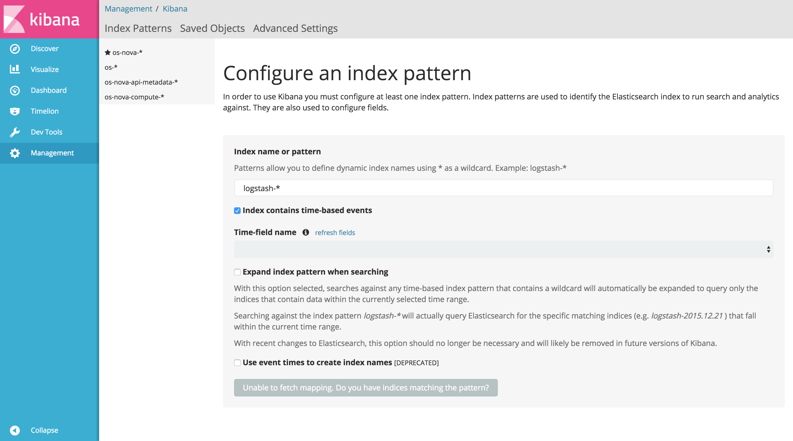
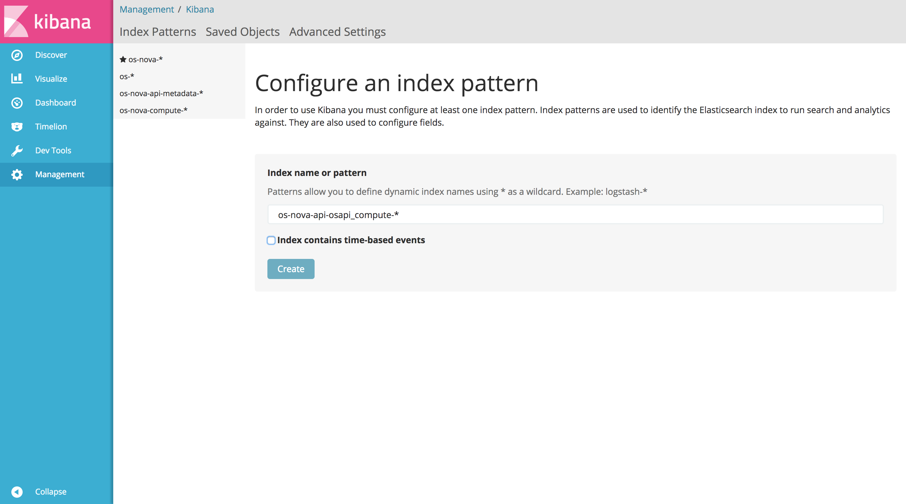
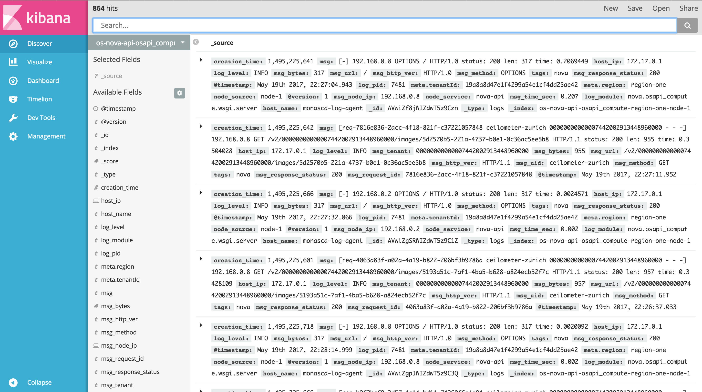
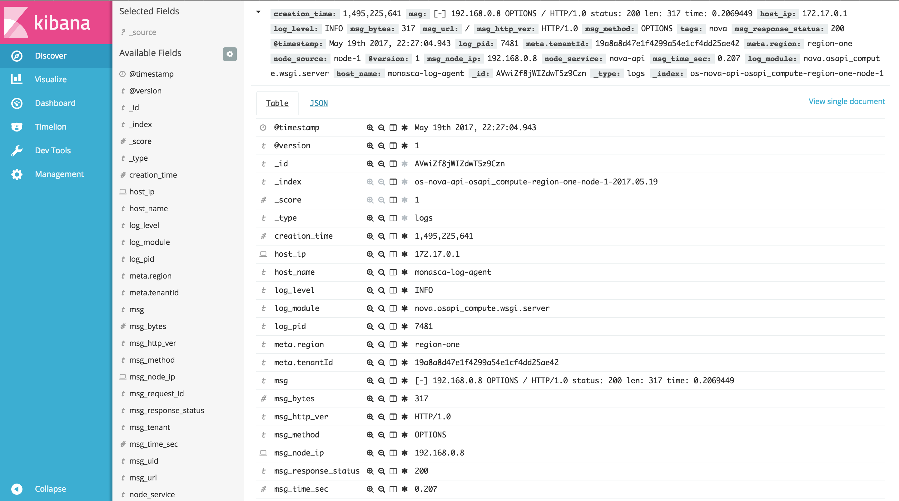

## Searching logs in Kibana
Kibana provides a front-end to Elasticsearch. Quoting the [introduction][1] from [Kibana's User Guide][2],

> Kibana allows to search, view and interact with the logs, as well as perform data analysis and visualize the logs in a variety of charts, tables and maps.

Viewing logs in Kibana is a straightforward two-step process.

#### Step 1: create an index pattern
Open Kibana at `kibana.example.com`. Select the `Management` section in the left pane menu, then `Index Patterns`. Then, depending on Kibana's version, either click `Add` or `+`.

Enter the [index pattern][3], and uncheck `Index contains time-based events`. As soon as Kibana checks the index pattern against Elasticsearch and the result is positive, the button at the bottom will activate and display `Create`.

Click `Create` to configure the index pattern.

#### Step 2: view the logs
Navigate to the `Discover` section in the left pane menu. On the left  of the page, just under the search bar, select the index pattern just created and all the logs matching the index will be displayed.

Every log entry can be inspected by clicking the small triangular bullet just besides it on the left. Each entry can be viewed as either table or JSON.

Search results can be filtered, using the following buttons

to respectively filter for value, filter out value, toggle column view in the table, and filter for field present.

However, the search bar is the best place for querying and filtering the logs, using the Lucene [query syntax][4] or the full JSON-based [Elasticsearch Query DSL][5]. More details on searching data, managing searches, etc. are [here][6].

[1]:https://www.elastic.co/guide/en/kibana/5.4/introduction.html
[2]:https://www.elastic.co/guide/en/kibana/5.4/index.html
[3]:https://www.elastic.co/guide/en/kibana/5.4/tutorial-define-index.html
[4]:https://lucene.apache.org/core/2_9_4/queryparsersyntax.html
[5]:https://www.elastic.co/guide/en/elasticsearch/reference/5.4/query-dsl.html
[6]:https://www.elastic.co/guide/en/kibana/5.4/search.html
