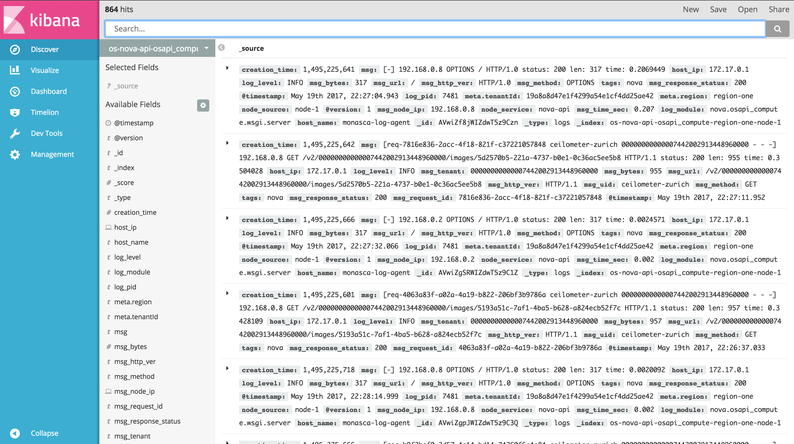

## Quick Start User Guide

#### Searching the logs
Open Kibana at `kibana.example.com`. Select the `Discover` section in the left pane menu.

On the top left, just above the search bar, the number of log entries currently displayed is shown. As the system keeps running, that number is expected to grow, as more logs are received.

Just below the search bar, there is a grey button displaying a pattern that starts with `os`. That is an index pattern, i.e. a search criterion that selects all log entries whose Elasticsearch index matches the pattern. If this does not quite make sense, no need to worry. Just keep reading.

In order to get started it is sufficient to know that index patterns are used to select logs from a specific Openstack component. Click the grey button to view the list of available index patterns.
Here follows the list of all generic index patterns:
+ `os-*`: match all Openstack logs
+ `os-nova-*`: match Nova logs
+ `os-neutron-*`: match Neutron logs
+ `os-cinder-*`: match Cinder logs
+ `os-keystone-*`: match Keystone logs

Index patterns can also be more specific, allowing to narrow down the search to services and modules. Here follows the list of more specific index patterns, grouped by Openstack component:
+ Nova
    - `os-nova-api-*`: match Nova API logs
    - `os-nova-api-osapi_compute-*`: match logs of the `osapi_compute` module in the Nova API
    - `os-nova-api-metadata-*`: match logs of the `metadata` module in the Nova API
    - `os-nova-compute-*`: match logs of Nova Compute nodes
+ Neutron
    - `os-neutron-api-*`
+ Cinder
    - `os-cinder-api-*`
+ Keystone
    - `os-keystone-api-*`

Every index is structured to contain also information about the region, the node and the date. For example, a Nova log from the `compute` node 10 located in region Switzerland and generated on May 22nd 2017 would look as follows:

    os-nova-compute-switzerland-node-10-2017.05.22

Knowing how indices are structured is useful to customize the search according to one's needs. For example, a proper index pattern to query all Nova API's logs from node 10 would be:

    os-nova-api-*node-10-*

Note the search flexibility allowed by the use of wildcards (`*`), which are used in patterns to represents zero or more characters, thus allowing to match [multiple indices][1].
#### Visualizations
In order to extract useful information from the logs (e.g. usage of resources, correlation between errors, API response times, etc.), Kibana provides [visualizations][2].

A set of predefined visualizations is available:
+ `openstack error correlation`: a line chart to plot the occurrences of errors, possibly suggesting correlation between errors of different Openstack components
+ `nova-api response time average`: a line chart to plot the average Nova API's response time against time
+ `nova-api response time range`: a pie chart to identify ranges in the Nova API's response time
+ `nova-compute resource ram`: a line chart to plot the usage of physical RAM against the total available on Nova Compute nodes
+ `nova-compute resource disk`: a line chart to plot the usage of physical disk against the total available on Nova Compute nodes
+ `nova-compute resource vcpus`: a line chart to plot the number of used virtual CPUs against the total available on Nova Compute nodes
+ `openstack tenant activity top 5`: a vertical bar chart with a top 5 ranking of Openstack tenants' activity, i.e. production of logs

Keep reading the guide to learn how to create [custom visualizations](kibana-visual.md).

[1]:https://www.elastic.co/guide/en/elasticsearch/reference/5.x/multi-index.html
[2]:https://www.elastic.co/guide/en/kibana/5.x/visualize.html
